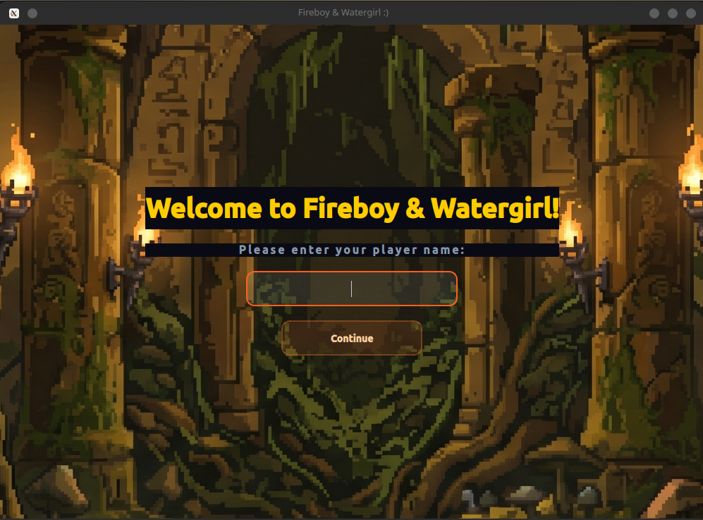
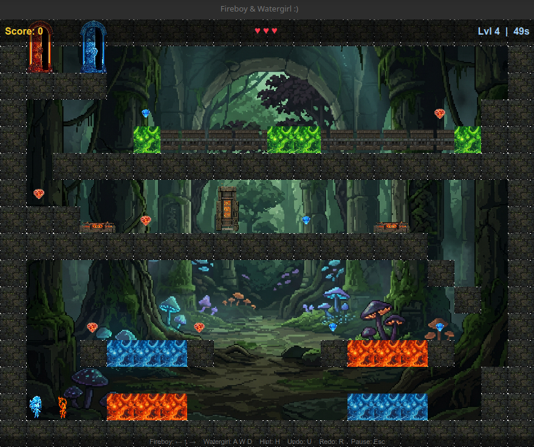
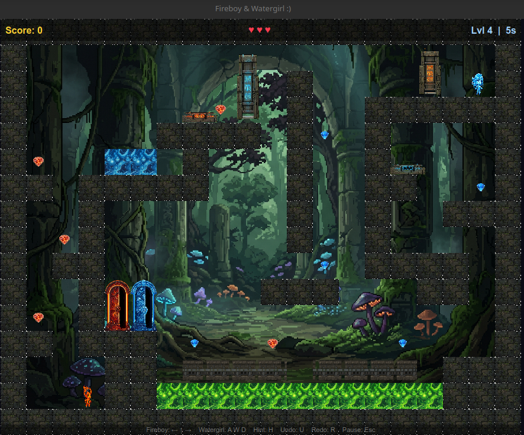

# Fireboy & Watergirl: C++ Desktop Port

## Introduction
Welcome to the C++ desktop port of **Fireboy & Watergirl**, deeply inspired by the classic and beloved flash game from [Friv (The Forest Temple)](https://www.friv.com/z/games/fireboyandwatergirlforest/game.html). This project brings the iconic cooperative puzzle-platformer experience to the desktop environment, rebuilt from scratch using C++ and the Qt framework. Work together (or control both characters yourself!) to solve intricate puzzles, collect gems, avoid deadly hazards, and safely guide Fireboy and Watergirl to their respective doors.

---

## Screenshots

  
  
    
  

---
## Folder Structure & Main Functionality

The codebase is organized cleanly to separate logic, rendering, data structures, and assets:

*   **`src/`** 
    Contains all the `.cpp` source files. This is the heart of the project where the core game loop, physics, rendering, and custom data structures are actually implemented.
*   **`include/`** 
    Contains all the `.h` header files. This folder acts as the blueprint for the project, defining classes, structs, macros, and function signatures.
*   **`levels/`** 
    Dedicated entirely to level design. Contains the configurations, hardcoded tile maps, and coordinate placements for all objects in the game.
*   **`assets/`** 
    Stores all the external media required by the game, including sprites, background images, sound effects, and Qt stylesheets (`.qss`).
*   **`build/` & `bin/`** 
    These folders are generated automatically during the compilation process. `build/` holds temporary object files, while `bin/` holds the final playable executable.

---

## File Functionality Guide

Here is a quick breakdown of what every major file in the project does:

### Source & Headers
*   **`main.cpp`**
    The entry point of the application. It initializes the Qt Application loop, displays the initial Splash Screen, and launches the main `GameWindow`.
*   **`GameWindow.cpp` / `.h`**
    Manages the primary GUI window using Qt. It handles keyboard inputs, UI states (Main Menu, Leaderboards), and hosts the actual game rendering widget.
*   **`GameEngine.cpp` / `.h`**
    The brain of the game. It calculates frame-by-frame updates, processes gravity and collisions, handles puzzle logic (buttons opening gates), and determines win/loss conditions.
*   **`GameRenderer.cpp` / `.h`**
    Strictly handles the visual output. It takes the current state from the GameEngine and draws the tile map, character sprites, gems, hazards, and UI overlays onto the screen.
*   **`Player.cpp` / `.h`**
    Manages all character-specific behavior. This includes individual horizontal movement, jump physics, and tracking the state of Fireboy and Watergirl.
*   **`GameObjects.h`**
    The central hub for all core data structures. It defines the structs for Gems, Doors, Buttons, Gates, Platforms, and all global macros (like tile sizes and grid bounds).
*   **`DSA.cpp` / `.h`**
    A custom-built library of Data Structures and Algorithms. Contains tailored implementations of Stacks (for history), Queues (for event buffering), Binary Search Trees (for fast map/tile lookups), and sorting/searching algorithms used directly in gameplay.
*   **`Levels.cpp` / `.h`**
    Acts as the level catalogue. It populates and returns `LevelData` structs filled with 2D array tile layouts, spawn coordinates, and hazard setups for every stage.

---

## Data Structures and Algorithms (DSA) Usage

A core highlight of this project is the custom implementation of classical Data Structures and Algorithms directly into the game's mechanics:

## Data Structures

1. **Stack (Array-based):** Tracks player position history for respawns.
2. **Circular Queue:** Decouples game events (like win/gem) into a non-blocking pipeline.
3. **Doubly Linked List:** Connects level sequences and handles State History for the Undo/Redo feature.
4. **Priority Queue (Min-Heap):** Processes game events by importance (Death > Teleport > Win).
5. **Hash Map (Direct Address):** Provides O(1) instant lookups for matching Buttons to Gates and pairing Teleport Pads.
6. **Binary Search Tree (BST):** Stores the tile map sparsely, indexing tiles by flattened grid position.
7. **Singly Linked List:** Maintains a chronological trail of collected gems for end-of-level statistics.
8. **Conveyor Queue:** A specialized circular queue that continuously updates moving entities on conveyor belts.

## Algorithms

1. **Quick Sort ($O(n \log n)$):** Sorts massive lists of global leaderboard scores via divide-and-conquer.
2. **Linear Search ($O(n)$):** Checks general proximity collisions between characters and nearby objects.
3. **Binary Search ($O(\log n)$):** Instantly finds a specific player's rank within the sorted leaderboard.
4. **Dijkstra's Algorithm:** Calculates the true shortest path across the grid for the hint system, navigating around walls and evaluating zero-cost teleport jumps.
5. **Min-Heap Key Extraction:** Evaluates all remaining gems by inserting their Dijkstra path-lengths into a Min-Heap to continuously point the hint arrow to the *truly* closest reachable gem.
---

## How to Set Up and Play

### Prerequisites
*   A C++ compiler (`g++`, `clang`, or MSVC).
*   The **Qt Framework** (Qt 5 or Qt 6) installed and configured on your system.
*   `qmake` available in your system's PATH.

### Installation & Running
We have provided automated scripts to make building and running the game as easy as possible.

**For Linux Users:**
1. Open your terminal in the project directory.
2. Make the script executable: `chmod +x run_linux.sh`
3. Run the game: `./run_linux.sh`

**For Windows Users:**
1. Open Command Prompt or PowerShell in the project directory.
2. Simply execute the batch file: `run_windows.bat`

*(Alternatively, you can manually build the project by running `qmake FireboyWatergirl.pro` followed by `make` or `nmake` depending on your compiler).*

### Controls
*   **Fireboy (Red):** Use the **Arrow Keys** (Left, Right, Up) to move and jump.
*   **Watergirl (Blue):** Use **A, D, W** to move and jump.
*   **Objective:** Fireboy must avoid Water lakes, Watergirl must avoid Lava lakes. Both must avoid Green Poison! Collect your respective gems and reach your matching doors.

---

## Ending Note

Building a game from scratch using pure C++ and custom Data Structures is a challenging but incredibly rewarding journey. Whether you are a player looking to solve some nostalgic puzzles, or a developer diving into the code to see how custom physics and BSTs can be applied to game design, we hope you find this project both fun and educational. 
Feel free to add new levels to the game and enjoy 
!

Grab a friend, share your keyboard, and enjoy the adventure! :)

